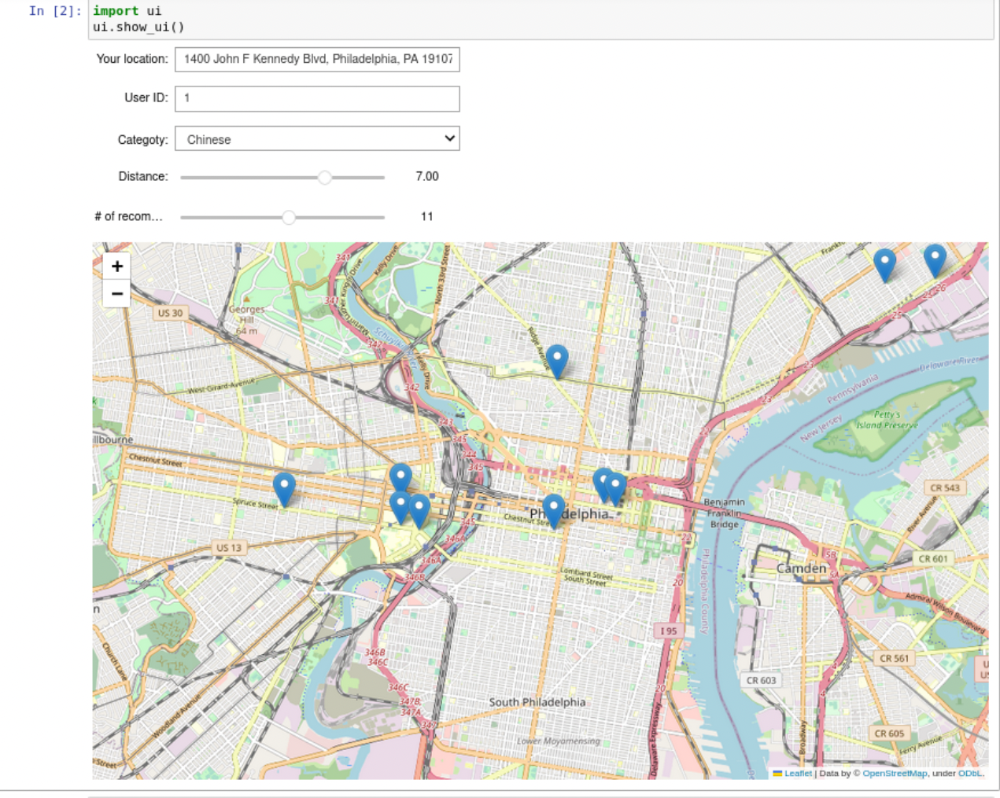

# FoodExplorer: Your Personal Restaurant Recommendation App for Philadelphia

    
    

In this project, we aim to develop a recommender system for restaurants in Philadelphia using Yelp business and review data. The system will leverage this dataset to generate personalized restaurant recommendations for users based on their preferences and past dining experiences. By analyzing factors such as cuisine type, price range, location, and user reviews, the recommender system will help users discover new dining options and make informed decisions when choosing restaurants in Philadelphia.

Through this project, we aim to create a valuable resource for residents and visitors of Philadelphia, making their restaurant selection process more enjoyable and convenient. The recommender system will serve as a trusted guide, helping users navigate the city's diverse dining landscape and discover hidden culinary gems while catering to their individual preferences.

`model_training.ipynb` shows the data cleaning and exploring process and `recommend.ipynb` is a simple UI that uses the trained model to make recommendations.Input your location, choose your favorite cuisine category, and set your preferred distance. FoodExplorer will provide you with personalized restaurant suggestions on an interactive map, making it easy to find the perfect dining spot. 

